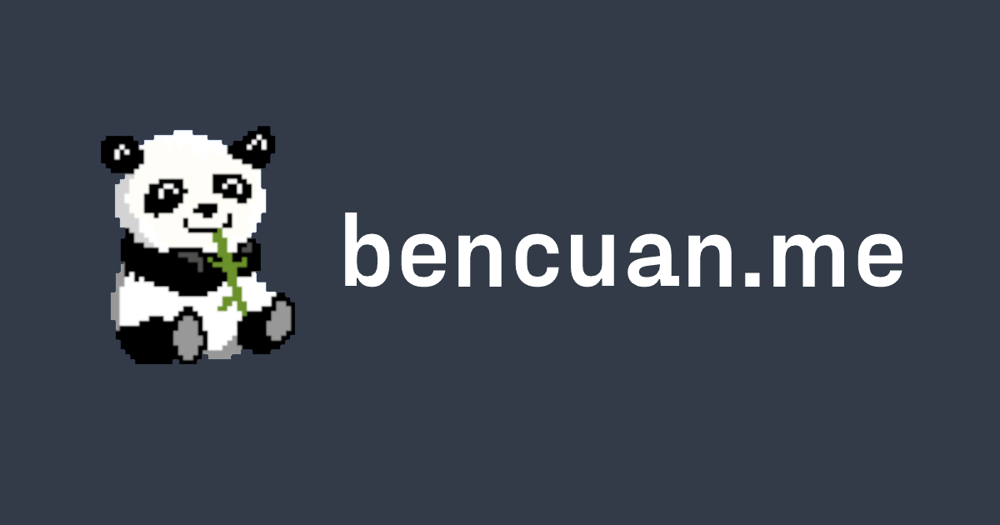

---

Hi there! I'm Ben, and here's my personal website.

I've been rebuilding my website every year- if you're interested, here are the [2018](https://bencuan.me/2018), [2019](https://bencuan.me/2019), [2020](https://bencuan.me/2020), and [2021](https://bencuan.me/2021) iterations.

## Development

### Quick Start
Make sure you have [NodeJS and NPM installed](https://docs.npmjs.com/downloading-and-installing-node-js-and-npm).

Then, run `npm i --save-dev` to install all dependencies, and `npm run develop` to start the development server.

### Fonts
I use fonts from [Pangram Pangram](https://pangrampangram.com/) (specifically [Fraktion Sans](https://pangrampangram.com/products/fraktion) and [Neue Montreal](https://pangrampangram.com/products/neue-montreal)), licensed for personal use.

Select styles are available for download for free at the links above, or all styles can be purchased for $29 [here](https://pangrampangram.com/products/fsp). Place the fonts in the `src/fonts` directory and you should be good to go!

Alternatively, the open-source Rubik font is made available as a backup, in which no additional configuration is needed.

### Custom Icons
Custom SVG's are converted into a webfont using Fontcustom, and compiled into the `src/fonts/` folder. To add additional icons, follow the [Fontcustom installation instructions](https://fontcustom.github.io/fontcustom/), place all SVG's into `src/fontcustom`, then run `npm run fontcustom`.

If 

### Credits
 - [Gatsby](https://www.gatsbyjs.com/)
 - [Fontcustom](https://github.com/FontCustom/fontcustom)
 - [Fontawesome](https://fontawesome.com/)
 - [normalize.css](https://necolas.github.io/normalize.css/)
 - [Pangram Pangram](https://pangrampangram.com/)

## Contact

Anything you want to tell me about? Send an email over to [contact@bencuan.me](mailto:contact@bencuan.me)!